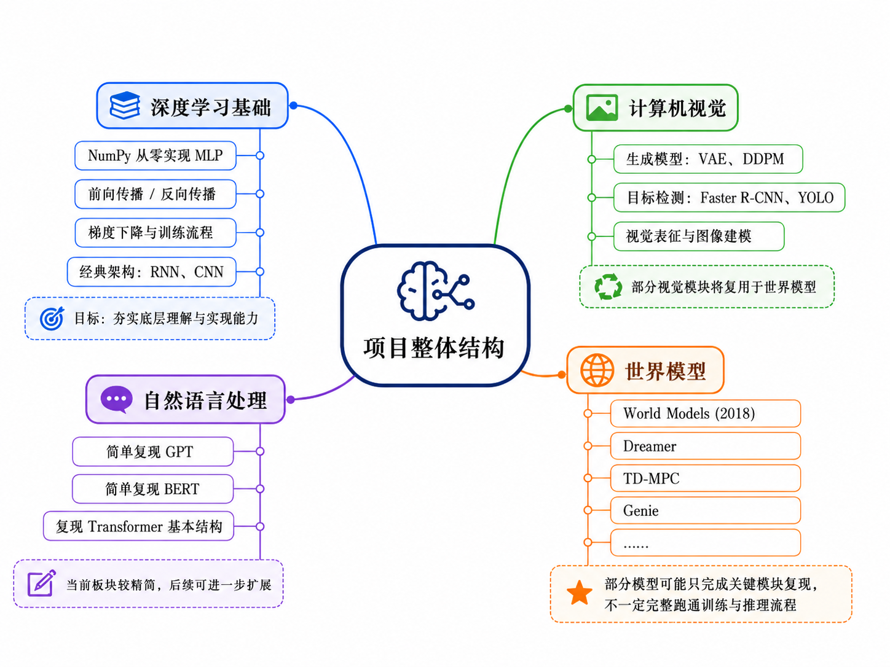

# Deep Learning Minimum

> Learn deep learning by implementing it.

这个项目名称致敬 *The Theoretical Minimum*。项目以代码为主，用于动手实现经典深度学习模型；当前内容从世界模型相关主题开始，并逐步扩展到深度学习基础、计算机视觉和自然语言处理。

所有学习内容主要以 Jupyter Notebook 编写，并由 Quarto 自动构建为静态网站。

**在线阅读：** <https://nonepf.github.io/deeplearning-minimum/>



## 内容

- 深度学习基础：基础模块、前向与反向传播、优化和经典架构
- 计算机视觉：生成模型、目标检测、视觉表征等
- 自然语言处理：Transformer、GPT、BERT 等
- 世界模型：World Models、Dreamer、TD-MPC、Genie 等

项目会长期、渐进式更新。部分主题可能只复现关键模块，不保证完整重现论文中的训练规模或基准结果。

## 本地使用

安装 Python 依赖后启动 Jupyter Lab：

```bash
python -m pip install -r requirements.txt
jupyter lab
```

安装 [Quarto](https://quarto.org/docs/get-started/) 后，可以在本地预览网站：

```bash
quarto preview
```

推送到 `main` 分支后，GitHub Actions 会渲染并发布网站。构建过程使用 Notebook 中已经保存的输出，不会重新执行训练代码。

## License

本项目采用 [MIT License](LICENSE)。
